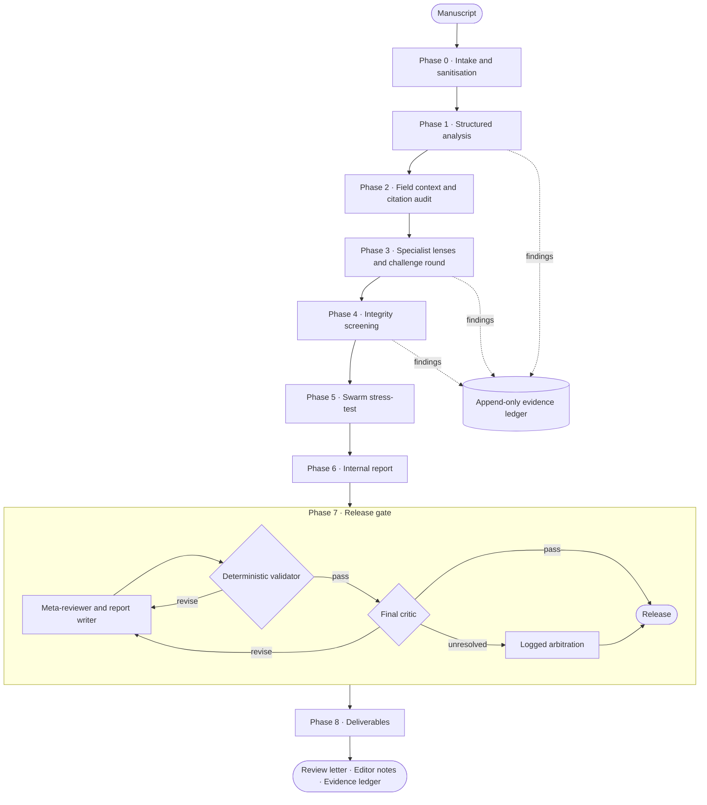
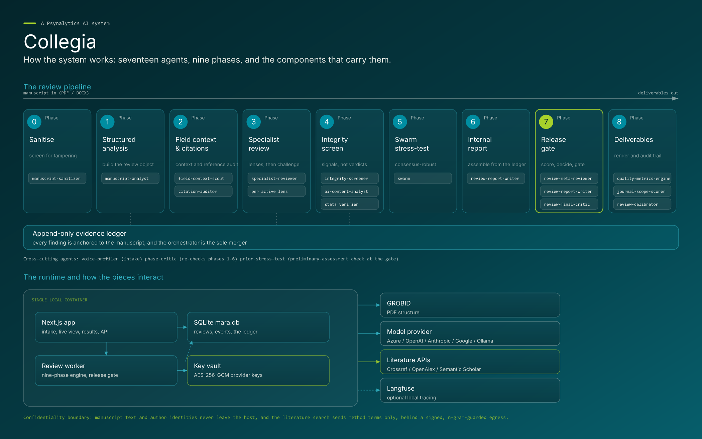

<div align="center">


<h1>MARA</h1>

<h3>Multi-Agent Review Architecture</h3>

**Evidence-grounded, confidential, multi-agent peer review for psychological and wellbeing science.**

<p>
  
  
  
  
  
  
</p>

<p>
  <a href="#executive-summary">Summary</a> ·
  <a href="#capabilities">Capabilities</a> ·
  <a href="#review-pipeline">Pipeline</a> ·
  <a href="#system-architecture">Architecture</a> ·
  <a href="#security-and-data-protection">Security</a> ·
  <a href="#deployment">Deployment</a> ·
  <a href="#operations">Operations</a> ·
  <a href="#quality-assurance">Quality</a> ·
  <a href="#documentation">Docs</a> ·
  <a href="#licence-and-legal">Licence</a>
</p>

</div>

---

> [!IMPORTANT]
> **Proprietary and confidential software.** Copyright © 2026 Llewellyn E. van Zyl and Psynalytics B.V. All rights reserved.
> No licence of any kind is granted by access to this repository. Use, execution, copying, modification, redistribution, evaluation, benchmarking, and any commercial or AI-training use are prohibited without a prior written agreement signed by the owner. See [LICENSE](LICENSE).

## Executive summary

MARA is a multi-agent system that produces rigorous, developmental peer review of psychology and wellbeing-science manuscripts. It reads a manuscript the way an expert third reviewer would: it establishes the field context, verifies every reference, examines the work through independent specialist lenses, recomputes the reported statistics, stress-tests its own conclusions, and delivers a publication-quality review letter together with confidential notes for the handling editor.

Three commitments define the system:

| Commitment | What it means in practice |
|---|---|
| **Every claim is evidenced** | Each finding is anchored to a location in the manuscript and recorded in an append-only evidence ledger. A deterministic release gate refuses to ship any letter whose claims do not reconcile with that ledger. |
| **Nothing confidential leaves the host** | Manuscript text, author identities, reviewer findings, and provider credentials stay on the machine that runs MARA. Outbound literature queries carry construct and method terms only, behind a signed, allowlisted, n-gram-guarded egress. |
| **Severity is honest, voice is developmental** | Verdicts are stated plainly, and every major concern carries its leanest credible fix and the recommendation it hinges on. Integrity concerns are always editorial signals, never accusations. |

## Capabilities

| Area | Capability |
|---|---|
| **End-to-end review** | A nine-phase pipeline, coordinated across seventeen specialised agents, from manuscript intake to branded Word deliverables. |
| **Specialist lenses** | Eleven review lenses (novelty, argumentation, theory, methods, statistics, measurement, qualitative, mixed methods, causal inference, practical significance, and ethics), selected by review depth and study design. Each takes a blind first pass, then a challenge round in which dissent held with confidence is preserved rather than averaged away. |
| **Field-calibrated critique** | A field dossier of comparator literature is retrieved for each manuscript, and the review argues against named benchmark works rather than critiquing internal logic alone. |
| **Reference verification** | Every reference is checked against Crossref, OpenAlex, and Semantic Scholar for existence and for claim-to-source alignment. |
| **Deterministic statistics audit** | Reported *t*, *F*, *r*, χ², and *z* results are recomputed from their statistics and degrees of freedom, impossible values are flagged, and reported means are checked for whole-number granularity (GRIM). This is pure arithmetic, at no model cost. |
| **Adversarial quality control** | An independent critic reviews each major phase, a swarm of reviewer profiles stress-tests which findings are robust, and a final critic attacks the letter before release. |
| **Deterministic release gate** | Programmatic checks for grounding, confidentiality, register, word budget, and structure. No agent certifies its own output; unresolved objections fall to a logged arbitration. |
| **Prompt-injection defence** | Hidden instructions aimed at an automated reviewer are detected, quarantined, and reported to the editor as a signal, and the review continues on sanitised text. Data-misrepresenting tampering halts the run. |
| **Personal reviewing voice** | Optionally, the letter adopts the register of the reviewer's own past letters. Only the style is learned; their content never enters the review. |
| **Live, inspectable runs** | A live run view streams phases, findings, costs, and gate decisions, and any finding can be opened mid-run to see its claim, anchor, severity, and suggested fix. |
| **Cost governance** | Per-dispatch cost accounting, projected-spend checks before every model call, and a configurable ceiling that pauses a run cleanly rather than overspending. |

## Review pipeline

```
Phase 0  Intake and sanitisation   Parse the manuscript; screen and quarantine embedded instructions
Phase 1  Structured analysis       Map claims, design, and evidence into a structured review object
Phase 2  Field context             Build the comparator dossier and audit every reference
Phase 3  Specialist review         Blind first pass per active lens, then a challenge round
Phase 4  Integrity screening       Statistics recomputation, reporting, similarity, AI-content, reproducibility
Phase 5  Swarm stress-test         Test which findings are consensus-robust; surface minority positions
Phase 6  Internal report           Assemble the full evidence-cited internal review
Phase 7  Release gate              Score the rubric, set the recommendation, write and gate the letter
Phase 8  Deliverables              Render branded documents and record calibration metrics
```



The orchestrator is the only component that merges findings into the ledger, and only at phase boundaries. A per-phase critic runs after Phases 1 to 6 and can re-dispatch a specialist lens when it finds a material gap. When the reviewer supplies a preliminary assessment at intake, it is withheld from every agent until the recommendation is set, and only then stress-tested against the evidence.

### Deliverables

| Deliverable | Audience | Contents |
|---|---|---|
| **Peer-review report** (`.docx`, `.md`) | Author and editor | Seven-part developmental letter: overview, recommendation, executive summary, major and section-by-section feedback, rubric scores, what would change the recommendation, and closing. |
| **Reviewer's private notes** (`.docx`, `.md`) | Editor only | Editorial synthesis, integrity signals, the strongest minority position, coverage limitations, and the run audit. |
| **Evidence ledger and run archive** | Audit | Every finding with its anchor, confidence band, severity, and supersession history. |

## System architecture

MARA is a single deployable unit. The web application and the review worker run side by side in one container, share a local SQLite database, and reach only the services an operator configures.

<div align="center">

</div>

| Layer | Technology |
|---|---|
| Web application | Next.js 16, React 19, server-sent events for live runs |
| Review engine and worker | Node.js 22, TypeScript (strict), Mastra workflows, single-lease durable job queue |
| Persistence | SQLite (WAL) via better-sqlite3 and Drizzle migrations; append-only ledger and event trail enforced by database triggers |
| Manuscript parsing | GROBID for PDF structure; Mammoth for DOCX |
| Model providers | Azure OpenAI (default), OpenAI, Anthropic, Google, or a local Ollama model, selectable per role |
| Observability | Structured event trail, rotating redacted logs, optional local Langfuse tracing |
| Contracts | Zod schemas shared by the application, the engine, and every agent output |

```
app/               Web application: intake, live run view, results, settings, API routes
server/src/
  engine/          Nine-phase pipeline, release gate, grounding validator, statistics audit
  workflow/        Ingest workflow: upload, parse, sanitise, clarify
  worker/          Single-lease worker, durable command queue, crash recovery, supervisor
  sanitize/        Deterministic and model-assisted prompt-injection screening
  citations/       Reference verification and guarded topic search
  providers/       Model registry, dispatch, pricing, and provider adapters
  security/        Egress guard, n-gram protection, encrypted key vault
  data/            Data access, events, deliverables, authentication
packages/shared/   Zod schemas for every agent output and the finding format
agents/            Seventeen agent definitions (method prompt and manifest each)
knowledge/         The canonical knowledge base: governance, lenses, decision, voice, templates, craft
docker/            Container image and entrypoint
docs/              Operations, configuration, security, and limitations references
```

## Security and data protection

Confidentiality is an architectural constraint, not a configuration option. The full model is documented in [docs/SECURITY.md](docs/SECURITY.md).

- **Local-first processing.** Manuscripts, findings, and deliverables are stored only on the host. The container publishes on the loopback interface by default.
- **Guarded egress.** Only allowlisted scholarly APIs are reachable. Queries are HMAC-signed and carry construct and method terms only, and an eight-gram guard blocks any query that overlaps protected manuscript text.
- **Prompt-injection defence.** Instructions embedded in a manuscript are never followed. They are quarantined before any agent sees the text, and the editor receives a signal describing what was found and where, without the injected text being repeated.
- **Confidential channel separation.** Integrity signals, editorial synthesis, and the preliminary-assessment stress test are confined to editor-only material. The release gate verifies that none of it reaches the author-facing letter.
- **Credential protection.** Provider keys stored through the application are sealed with AES-256-GCM envelope encryption under an operator-held master key. Keys supplied through the environment always take precedence.
- **Access control.** Optional instance passphrase with scrypt hashing, HTTP-only strict same-site sessions, cross-site request refusal on every state-changing route, and throttled sign-in attempts.
- **Integrity of record.** The evidence ledger and event trail are append-only at the database level; corrections supersede rather than overwrite.
- **Least privilege.** The container drops to an unprivileged user with no ability to regain privileges.
- **Supply chain.** Frozen lockfile installs, dependency audit at high severity, and full-history secret scanning run on every change.

## Deployment

### Requirements

| Component | Requirement |
|---|---|
| Host | Linux or macOS with Docker Engine 24+ and Docker Compose v2 |
| Memory | 8 GB minimum; 12 GB recommended (GROBID uses about 4 GB) |
| Model access | Azure OpenAI deployments, or an OpenAI, Anthropic, or Google key, or a local Ollama model |
| Network | Outbound HTTPS to the configured model provider and to Crossref, OpenAlex, and Semantic Scholar |

### Installation

Deployment is available only to licensed parties under a written agreement with the owner.

```bash
cp .env.example .env
# Set MARA_MASTER_KEY (openssl rand -hex 32) and the model-provider settings.
docker compose up -d
docker compose ps          # the mara service reports healthy when ready
```

The application is then available at `http://127.0.0.1:3100`. The first start builds the image, applies database migrations, and starts the web application, the review worker, and GROBID. All durable state is kept in `./data`.

### Configuration

All configuration is by environment variable, documented in full in [docs/CONFIGURATION.md](docs/CONFIGURATION.md) and annotated in [.env.example](.env.example). The principal settings are:

| Variable | Purpose |
|---|---|
| `MARA_MASTER_KEY` | 32-byte key for the provider-key vault. Required to store keys through the application. |
| `AZURE_*` | Azure OpenAI endpoint, certificate credentials, and the frontier and cheap deployments (the default provider). |
| `MARA_FRONTIER_PROVIDER` / `MARA_CHEAP_PROVIDER` | Route a role to `openai`, `anthropic`, `google`, or `local` instead of Azure, with the matching `MARA_*_MODEL`. |
| `MARA_BIND`, `MARA_PORT` | Host interface and port. Loopback by default. |
| `GROBID_URL` | PDF structure service. Provided by the bundled compose service. |
| `MARA_CONTACT_EMAIL`, `OPENALEX_API_KEY`, `SEMANTIC_SCHOLAR_API_KEY` | Polite-pool identification and higher rate limits for reference verification. |
| `MARA_PRICING_<MODEL>` | Per-model price override used by cost accounting and the cost ceiling. |
| `LANGFUSE_*` | Optional local tracing. |

## Operations

Day-to-day operation, monitoring, and recovery are covered by the [operations runbook](docs/OPERATIONS.md). In summary:

- **Resilience.** A non-critical unit that cannot complete becomes a recorded coverage gap rather than ending the run. Engine errors and release-gate blocks retry themselves in the background, and every failure keeps its artefacts so recovery is always a retry, never a rebuild.
- **Durable control.** Run, resume, retry, pause, and cancel are durable commands. Each is acknowledged in the same transaction as its effect, so a worker restart never loses or duplicates one.
- **Observability.** A per-review, append-only event trail that carries no manuscript text, a read-only timeline command, rotating redacted logs, and a health endpoint used by the container health check.
- **Backup and restore.** All state lives in a single directory and is backed up with the stack stopped.

## Quality assurance

| Control | Scope |
|---|---|
| Static analysis | TypeScript strict mode across all packages; Biome lint |
| Automated tests | Over 670 offline tests covering the engine, release gate, statistics, sanitiser, ingest, worker recovery, security controls, API routes, and UI logic. Every model dispatch is mocked, so tests never reach a provider. |
| Agent contracts | Golden outputs for every agent validated against the shared schemas, and a synchronisation test between the rubric in code and the knowledge base |
| Continuous integration | Typecheck, lint, tests, dependency audit, full-history secret scan, and a changelog requirement on every pull request |

Release history is recorded in [CHANGELOG.md](CHANGELOG.md).

## Documentation

| Document | Contents |
|---|---|
| [docs/OPERATIONS.md](docs/OPERATIONS.md) | Monitoring, failure classes and recovery, backup and restore, retention |
| [docs/CONFIGURATION.md](docs/CONFIGURATION.md) | Every environment variable, provider routing, and cost controls |
| [docs/SECURITY.md](docs/SECURITY.md) | Threat model, confidentiality controls, and responsible disclosure |
| [docs/LIMITATIONS.md](docs/LIMITATIONS.md) | Deliberate scope limits and the approach that would close each |
| [docs/DATASETS.md](docs/DATASETS.md) | Research notes on peer-review corpora for rating calibration |
| [knowledge/00_INDEX.md](knowledge/00_INDEX.md) | The knowledge base that governs every agent |

## Author

**Prof. Llewellyn E. van Zyl, PhD** is the Founder and Chief AI Solutions Architect of Psynalytics and works within Optentia at North-West University. His work sits at the intersection of data science, positive psychology, and the governance of artificial-intelligence systems.

MARA is designed, developed, and maintained by Psynalytics B.V.

## Licence and legal

**Proprietary. All rights reserved.** Copyright © 2026 Llewellyn E. van Zyl and Psynalytics B.V.

This repository is made visible for reference only. No right or licence is granted to use, run, install, copy, reproduce, modify, translate, adapt, fork, distribute, publish, sublicense, sell, host, benchmark, evaluate, reverse engineer, or create derivative works of the software, its prompts, its knowledge base, or its documentation, in whole or in part. **Commercial use of any kind is prohibited.** Use of any part of this repository to train, fine-tune, evaluate, or prompt a machine-learning or artificial-intelligence system is prohibited. The full and binding terms are in [LICENSE](LICENSE).

Licensing and permission enquiries: **hello@psynalytics.com**.

## Disclaimer

MARA produces developmental, pre-submission editorial feedback. It is not affiliated with any journal or publisher, is not a certification of quality, and is not a substitute for human peer review or professional judgement. All outputs are advisory and must be verified by a qualified person before any reliance is placed on them.
